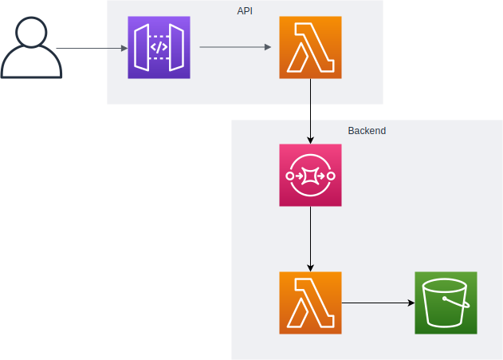

# Example Java app deployed with AWS CDK

## Architecture


## Project Setup

Generate root project
```bash
mvn --batch-mode archetype:generate \
    -DarchetypeGroupId=org.codehaus.mojo.archetypes \
    -DarchetypeArtifactId=pom-root \
    -DarchetypeVersion=RELEASE \
    -DgroupId=com.myapp \
    -DartifactId=root-app \
    -Dversion=0.1

cd root-app
```

Generate sub-project: backend service module
```bash
mvn --batch-mode archetype:generate \
    -DarchetypeGroupId=org.apache.maven.archetypes \
    -DarchetypeArtifactId=maven-archetype-quickstart \
    -DarchetypeVersion=RELEASE \
    -DgroupId=com.myapp \
    -DartifactId=backend \
    -Dversion=0.1
```

Generate sub-project: backend API module
```bash
mvn --batch-mode archetype:generate \
    -DarchetypeGroupId=org.apache.maven.archetypes \
    -DarchetypeArtifactId=maven-archetype-quickstart \
    -DarchetypeVersion=RELEASE \
    -DgroupId=com.myapp \
    -DartifactId=api \
    -Dversion=0.1
```

Initialise CDK sub-project: deployment module
```bash
mkdir deployment
cd deployment

cdk init sample-app --language=java
```

## Package and deploy

```bash
# goto app root dir
cd root-app

# package everything
mvn package
mvn install
```

[Optional] Bootstrap CDK
```bash
export AWS_PAGER=""
export AWS_ACCOUNT=$(aws sts get-caller-identity --output text --query 'Account')
export AWS_REGION=ap-southeast-2 # or your closest region

cdk bootstrap
```


```bash
# Now deploy
# Note: setup your AWS credentials via either aws-configure or environment variables
cd deployment
cdk deploy
```

Delete all deployed resources
```bash
cdk destroy
```

## References

* [AWS CDK Developer Guide](https://docs.aws.amazon.com/cdk/latest/guide/home.html)
* [AWS CDK API Reference](https://docs.aws.amazon.com/cdk/api/latest/docs/aws-construct-library.html)
* [CDK Workshop](https://cdkworkshop.com/)

* [Using AWS Lambda (Java) with API Gateway](https://www.baeldung.com/aws-lambda-api-gateway)